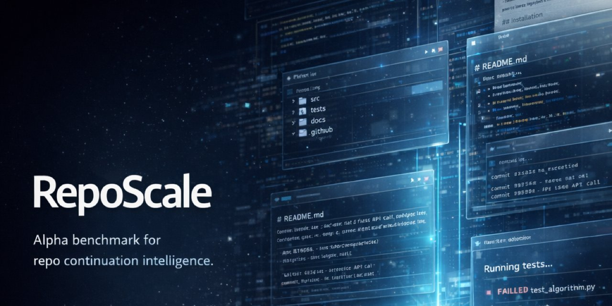

# RepoScale

[](https://github.com/mverab/Reposcale/actions/workflows/ci.yml)


**RepoScale is an alpha benchmark for repo continuation intelligence.**

Measure how well models work on existing software projects instead of toy coding tasks.

RepoScale ships a reproducible CLI pipeline, a 12-case curated corpus, judge stability scoring, and baseline-ready workflows for early adopters and contributors.

> **Alpha release.** Runnable, inspectable, and useful today. Not a final neutral benchmark yet.

[**Corpus**](cases/CORPUS.md) • [**Baseline**](docs/baseline-v0.md) • [**Case Authoring**](docs/case-authoring.md) • [**Launch Kit**](docs/launch-kit.md) • [**Changelog**](CHANGELOG.md)



## What is RepoScale?

RepoScale evaluates whether a model can:
- read an existing codebase
- infer what the project was trying to become
- identify what is missing, broken, or risky
- propose a continuation path that fits the repo

It is built for repo-shaped work: partial implementations, stale docs, historical baggage, conflicting intent, and unfinished ideas.

## Quick Start (3 Steps)

### 1. Install

```bash
pip install -e .
```

### 2. Validate the corpus

```bash
find cases -name case.yaml -exec dirname {} \; | xargs reposcale validate
```

### 3. Run and score one model

```bash
reposcale batch cases/ --model gpt-4o
reposcale score results/<run-id>/ --judge-model gpt-4o --repeat 3
reposcale compare results/<run-a>/ results/<run-b>/
```

Want a one-command baseline? Use [scripts/run-baselines.sh](scripts/run-baselines.sh).

## What you get after running

```text
results/<run-id>/
├── diagnose-001/
│   ├── response.json
│   └── evaluation.json
├── intent-001/
│   ├── response.json
│   └── evaluation.json
└── plan-001/
    ├── response.json
    └── evaluation.json
```

And then:
- `reposcale summary` for single-run metrics
- `reposcale compare` for side-by-side model comparison
- stability metadata when scoring with `--repeat`

## Why it matters

Most software work does not start from a blank file.

It starts with an existing repo: partial implementations, stale docs, architectural baggage, conflicting intent, and unfinished ideas. RepoScale focuses on that environment instead of isolated algorithmic tasks or greenfield generation.

## What you get today

| Area | Current alpha scope |
|------|---------------------|
| Corpus | 12 curated cases across 3 tracks and 3 difficulty levels |
| Tracks | Diagnose, Intent, Plan |
| Pipeline | `validate -> batch/run -> score -> summary -> compare` |
| Scoring | Structural, heuristic, and LLM-judge scoring with stability repeats |
| Tooling | CLI, CI, case authoring guide, corpus manifest, baseline script |

Primary references:
- [Corpus manifest](cases/CORPUS.md)
- [Baseline v0](docs/baseline-v0.md)
- [Case authoring guide](docs/case-authoring.md)
- [Changelog](CHANGELOG.md)

## Alpha scope

RepoScale is public as an **alpha**, not a benchmark-grade final release.

That means:
- the pipeline is runnable and reproducible
- the corpus is large enough to be useful, but still small
- methodology is evolving, especially around judge neutrality and cross-provider baselines
- the best next contributions are new cases, baseline runs, and scoring improvements

## Benchmark tracks

| Track | Core question | Output |
|-------|---------------|--------|
| **Diagnose** | What exists, what is missing, and what is broken? | Structured diagnosis with evidence |
| **Intent** | What was this project trying to become? | Intent reading, fulfillment, deviations |
| **Plan** | What is the realistic path to scale it? | Phased roadmap, risks, first sprint |

Planned later tracks:
- `Extend`
- `Implement`
- `Agent`

## Perfect for

- model eval builders who want repo-shaped tasks instead of toy prompts
- agent-tool teams testing repo understanding and continuation quality
- OSS contributors who want to add cases, baselines, or scoring layers
- researchers exploring intent reconstruction, gap detection, and architectural coherence

## Execution modes

| Mode | Description |
|------|-------------|
| `prompt_only` | No tools, only packed textual context |
| `read_only_repo` | Read access to repo, no modifications |
| `history_aware` | Includes commit history, changelogs, harness logs |
| `tool_augmented` | Can search files, read modules, inspect metadata |
| `agentic_budgeted` | Coding agent access with step/time/token budget |
| `full_continuation` | End-to-end analyze, propose, implement, validate |

## Core principles

- **Evidence first** — claims must be grounded in the repo, docs, or history
- **Continuity over rewrite** — respect the project that exists
- **Creativity with constraints** — contextual ideas beat generic advice
- **Multi-layer evaluation** — structure, semantics, stability, and judgment
- **Open and reproducible** — cases, prompts, schemas, and scripts stay inspectable

## Repository map

```text
src/reposcale/  core Python package (validate, run, score, summary, compare)
cases/          benchmark case packs organized by track
docs/           baselines, authoring guide, and reference material
schemas/        JSON schemas for cases, responses, and evaluations
prompts/        task prompts and judge protocol
scripts/        wrappers and baseline runner
tests/          pytest suite
results/        evaluation outputs (gitignored)
```

## Documentation

| Resource | What it gives you |
|----------|-------------------|
| [cases/CORPUS.md](cases/CORPUS.md) | Full case inventory and coverage |
| [docs/baseline-v0.md](docs/baseline-v0.md) | First baseline and calibration notes |
| [docs/case-authoring.md](docs/case-authoring.md) | How to create new cases |
| [docs/scoring.md](docs/scoring.md) | Scoring model and dimensions |
| [CONTRIBUTING.md](CONTRIBUTING.md) | Contribution workflow |
| [CHANGELOG.md](CHANGELOG.md) | Release history |

## Contributing

The most useful contributions right now are:
- case curation
- baseline runs across additional providers
- judge calibration and methodology review
- CLI and scoring improvements
- failure-mode analysis

Start with [CONTRIBUTING.md](CONTRIBUTING.md), then use [docs/case-authoring.md](docs/case-authoring.md) if you're adding cases.

## Launch resources

For public launch copy, suggested repo topics, and a release checklist, see [docs/launch-kit.md](docs/launch-kit.md).

## Support

- Issues: [GitHub Issues](https://github.com/mverab/Reposcale/issues)
- Discussions: use pull requests and release notes for now
- Baseline script: [scripts/run-baselines.sh](scripts/run-baselines.sh)

## License

[MIT](LICENSE)
